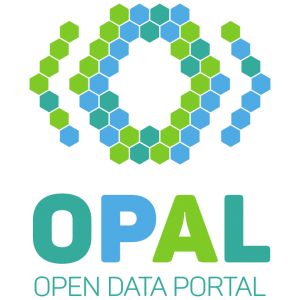

---
title:   
author: Adrian Wilke   Prof. Dr. Axel Ngonga   [dice-research.org](https://dice-research.org/)   Universität Paderborn
date: 15.12.2020
...

# OPAL   Open Data Portal Germany     Abschluss­prä­sen­ta­ti­on

## Agenda

- Projekt: **9 Arbeitspakete** (AP) mit **39 Deliverables**
- Arbeitsplan, Arbeitsziele, Soll-IST-Zustand
    - **SOLL**: Kurze Beschreibung der AP
    - **IST**: Vorstellung der Projektergebnisse
- **Fragen**: jederzeit, bestenfalls nach Deliverables  
  Markierung dazu in dieser Präsentation: ✓

## Zeitplan (flexibel)

- [OPAL Portal Demo](http://opalpro.cs.upb.de:3002/)
- 09:15 – 10:30 Uhr
- 10:45 – 12:00 Uhr

## Gesamtziel des Vorhabens

"Das OPAL-Projekt konzipiert und entwickelt  
ein **Linked-Open-Data-Portal**
mit Fokus auf  
**öffentlichen Datenquellen aus Deutschland** [...]."

## Arbeitspakete

1. Anforderungsanalyse und Architektur
2. Datenakquisition
3. Datenanalyse
4. Datenkonvertierung
5. Datenintegration
6. Datenselektion
7. Anwendungsfälle
8. Portalentwicklung
9. Projektmanagement

