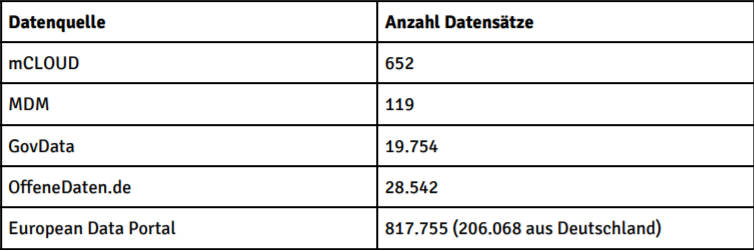

## D1.2 Datenanalyse

- Technische und statistische Analyse
- Detaillierte Analyse zufällig ausgewählter Datensätze 

- Deliverable als [PDF-Datei](https://hobbitdata.informatik.uni-leipzig.de/OPAL/Deliverables/OPAL_D1.2_Datenanalyse.pdf)
- Heute: Informationen obsolet (folgt gleich)

## D1.2 Datenanalyse

- **Datenvolumen**
  (2,5 Jahre: Mai 2018 – Dezember 2020) 
    - [mCLOUD](https://mcloud.de/): 652 → 3.276 
    - [EDP](https://www.europeandataportal.eu/data/datasets?locale=en&country=de&minScoring=0&page=1): 817.000 → 1.184.000
- Neuerungen / Obsoleszenz: 
    - **jQuery** obsolet (MDM Relaunch) → HTML
    - **DCAT**-AP.de XML/RDF (mCLOUD [1.5.0](https://mcloud.de/web/guest/blog/-/blogs/mcloud-release-1-5-0), 11.04.19)
    - **Datenfluss**:
      mCLOUD → Govdata → EDP  
      (mCLOUD [1.6.0](https://mcloud.de/web/guest/blog/-/blogs/mcloud-release-1-6-0), 16.07.19)

## D1.2 Datenanalyse

- **OPAL Graph** (Oktober/November 2020)
    - **MDM**: 203
    - **mCLOUD**: 2.853
    - **GovData**: 37.932
    - **European Data Portal (EDP)**: 795.387  
      (191.374 mit deutschen und englischen Titeln)  
- OPAL Daten auf [mCLOUD](https://mcloud.de/)  
  _Deliverable abgeschlossen_ ✓

