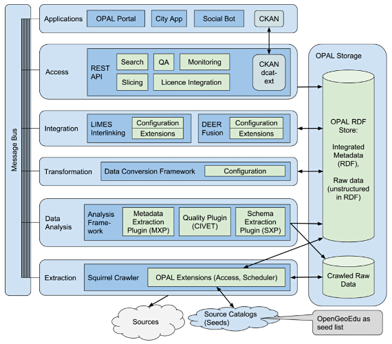

## D1.3 Architektur (2017/2018)

Deliverable als [PDF-Datei](https://hobbitdata.informatik.uni-leipzig.de/OPAL/Deliverables/OPAL_D1.3_Architecture.pdf)

## D1.3 Architektur (Auszug 2020)

- Neu: Sequentielle Behandlung von Datensatz-Graphen
- Neu: Elasticsearch
- Code: [OPAL Batch](https://github.com/projekt-opal/batch) ✓

