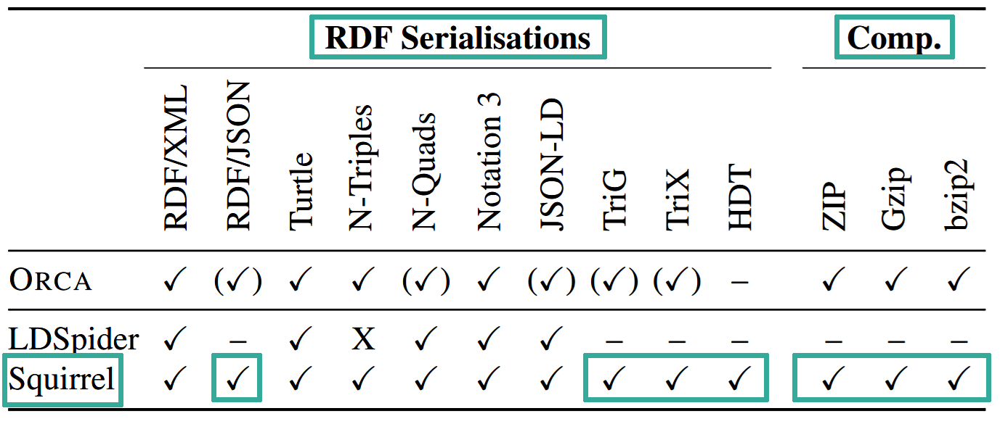

## D2.6 Finale Crawler-Benchmark-Ergebnisse

Evaluierung: Synthetischer Benchmark

## D2.6 Finale Crawler-Benchmark-Ergebnisse

## D2.6 Finale Crawler-Benchmark-Ergebnisse

Deliverable als [PDF-Datei](https://hobbitdata.informatik.uni-leipzig.de/OPAL/Deliverables/OPAL_D2.6_Finale_Crawler-Benchmark-Ergebnisse_ORCA.pdf),
[Update 2020](https://arxiv.org/pdf/1912.08026.pdf) ✓

