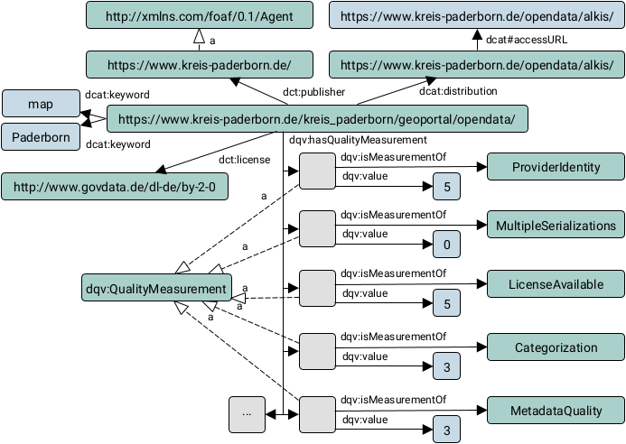

## D3.2 Qualitätsanalyse-Komponente

- Vokabular in D4.1 erläutert
- Deliverable als [PDF-Datei](https://hobbitdata.informatik.uni-leipzig.de/OPAL/Deliverables/OPAL_D3.2_Quality-analysis-component.pdf) und Code ([Civet](https://github.com/projekt-opal/civet)) ✓

