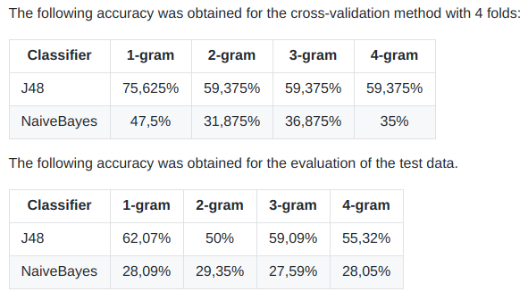

## D3.4 Topic-Extraktionskomponente

### Ansatz 1: Topic-Extraction

- Extrahiert Entitäten aus Texten (z.B. Datum, Ort)
- Englischsprachige Texte
- Problem: Viele Herausgeber, heterogene Texte
    - date precision: 1.0
    - date recall: 0.08695652173913043
    - date f1-score: 0.16
    - place precision: 1.0
    - place recall: 0.3235294117647059
    - place f1-score: 0.48888888888888893
- Deliverable (Code): [Topic-Extraction](https://github.com/projekt-opal/Topic-Extraction)

## D3.4, Ansatz 2: Klassifizierung Kategorien

- Klassifizierung von DCAT Kategorien (themes)
- Nutzung von Entscheidungsbäumen und TF-IDF
- Deliverable (Code): [classification](https://github.com/projekt-opal/classification)

 ✓

