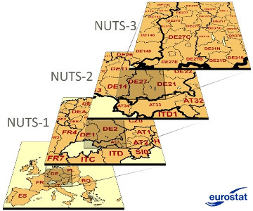

## D3.5 Finale Datenanalysekomponenten

- Qualitätsanalyse-Komponente Civet (D3.1, D3.2)
- Metadatenextraktions-Komponente (D3.3)
    - Erweiterung um **Geo-Daten** (D3.5, folgt gleich)
- Topic-Extraction und Klassifizierung (D3.4)

## D3.5 Finale Datenanalysekomponenten

### Metadatenextraktions-Komponente: LauNuts

- Neu: Metadatenextraktions-Komponente mit  
    - Nomenclature of Territorial Units for Statistics ([NUTS](https://ec.europa.eu/eurostat/web/nuts/background))
    - Local Administrative Units (LAU)
- **11.953 Orte** (DE/AU) mit Namen und Koordinaten
- Code: [metadata-refinement](https://github.com/projekt-opal/metadata-refinement)  ✓

