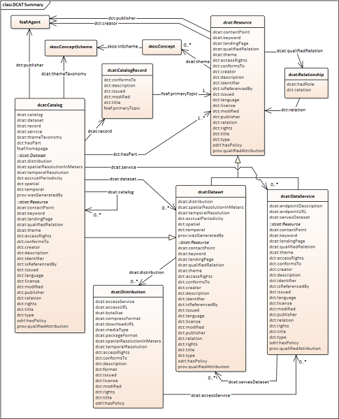
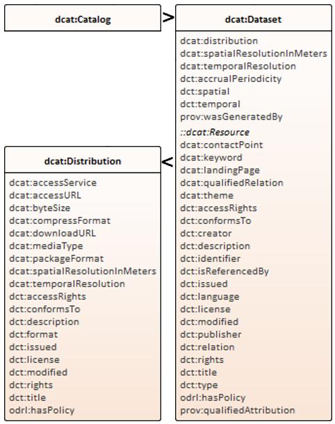
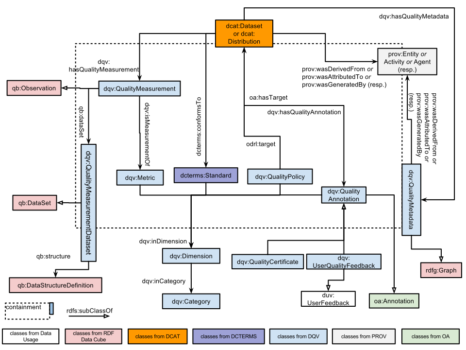

## D4.1 Vokabularspezifikation

- **Data Catalog Vocabulary (DCAT)**  
  Version 2, W3C Recommendation 04 February 2020  
  [www.w3.org/TR/vocab-dcat-2](https://www.w3.org/TR/vocab-dcat-2/)  
  &nbsp;
- **Data Quality Vocabulary (DQV)**  
  15 December 2016  
  [www.w3.org/TR/vocab-dqv](https://www.w3.org/TR/vocab-dqv/)

## D4.1 Vokabularspezifikation: DCAT

## D4.1 Vokabularspezifikation: DCAT

## D4.1 Vokabularspezifikation: DQV

## D4.1 Vokabularspezifikation: RDF Beispiel

- Beispiel: [OPAL Civet - metadata quality component.](https://github.com/projekt-opal/civet#example-output)
- Deliverable als [PDF-Datei](https://hobbitdata.informatik.uni-leipzig.de/OPAL/Deliverables/OPAL_D4.1_Vocabulary-specification.pdf)

