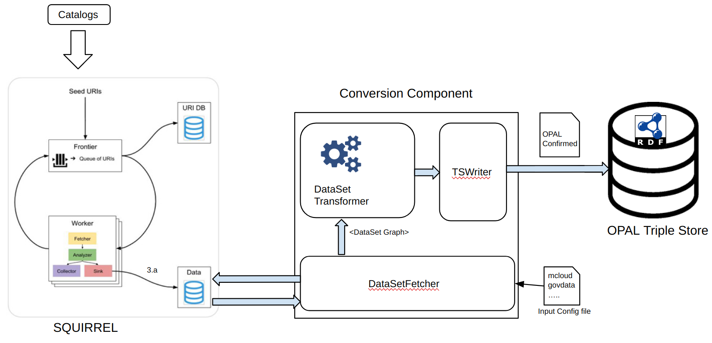
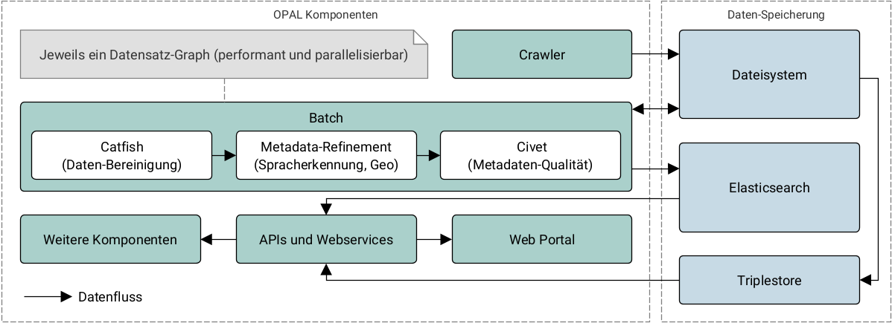

## D4.2 Konvertierungskomponente: Converter

- Publish-Subscribe Microservices via Spring Cloud
- Code: [Converter](https://github.com/projekt-opal/converter)  
- Konfiguration: [Converter-configuration](https://github.com/projekt-opal/converter-configuration)

## D4.2 Konvertierungskomponente: Batch

- Sequentielle Behandlung von Datensatz-Graphen
- Elasticsearch
- Code: [OPAL Batch](https://github.com/projekt-opal/batch), [OPAL Catfish](https://github.com/projekt-opal/catfish)
- Deliverable als [PDF-Datei](https://hobbitdata.informatik.uni-leipzig.de/OPAL/Deliverables/OPAL_D4.2_Conversion_component.pdf) ✓

