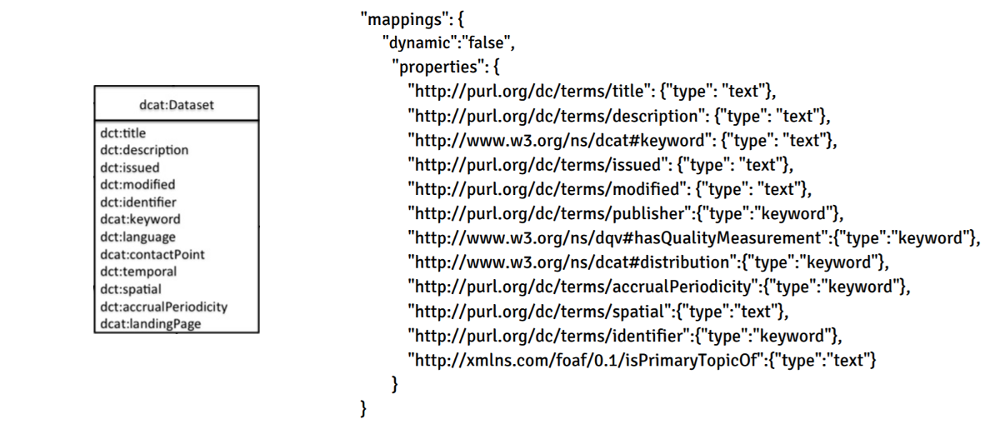

## D4.3 Prototyp Indexstrukturen und Entitätserkennung

### D4.3: Entitätserkennung

- D3.3 Metadatenextraktionskomponente
    - **Named Entity Recognition** (FOX)
- D3.4 Topic-Extraktionskomponente
    - **Topic**-Extraction (**Ort**, **Datum**)
    - Klassifizierung **DCAT Kategorien** (themes)
- D3.5 Metadatenextraktions-Komponente
    - LauNuts (**Geo Daten**)
- D4.4 Indizierungskomponente
    - **Disambiguierung** (AGDISTIS/MAG)

## D4.3: Indexstrukturen

- RDF DCAT → Elasticsearch Mappings
- Deliverable als [PDF-Datei](https://hobbitdata.informatik.uni-leipzig.de/OPAL/Deliverables/OPAL_D4.3_Index-structures.pdf) ✓

