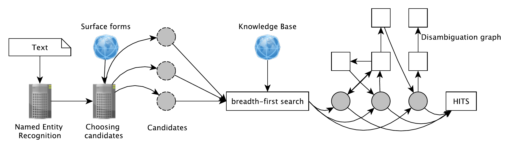
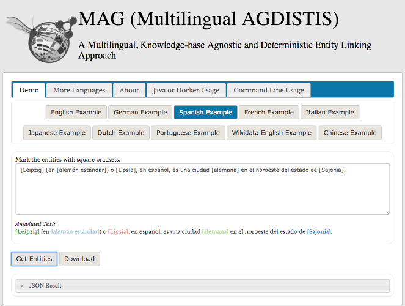

## D4.4 Indizierungskomponente

- Disambiguierung / Linking Entitäten, mehrsprachig
- Graph basiertes Verfahren (HITS algorithmus)
- Erweitert in LIMBO: Elasticsearch
- Integration in OPAL: geografische DB LauNuts

## D4.4 Indizierungskomponente

Deliverable (Code): [AGDISTIS](https://github.com/projekt-opal/AGDISTIS) ✓

