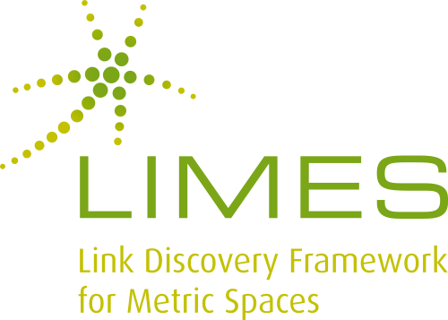

## D5.1 Erste Version der Verknüpfungskomponente

- Deliverable (Code): [LIMES 1.5.0](https://github.com/dice-group/LIMES/releases/tag/1.5.0)
- Im Folgenden verwendet

## D5.1 Verknüpfungskomponente: LIMES (1/3)

- **LIMES**: Link Discovery Framework for Metric Spaces
- **Überschneidungen** in versch. Wissensgraphen **finden**
    - z.B. **Erstellung Verknüpfungen** zwischen gleichen
Ressourcen in verschiedenen Wissensgraphen
    - z.B. **geografische Ähnlichkeiten** finden
- Verwendung von **Metriken**, die Inhalte vergleichen
- Verwendet Dreiecksungleichung (aus der Geometrie / Mathematik).
- Verringert Anzahl benötigter
Vergleiche.
- LIMES-Framework: Grundlage maschinellen Lernens

## D5.1 Verknüpfungskomponente: WOMBAT (2/3)

- **WOMBAT**: A Generalization Approach for Automatic Link Discovery
- Ansatz des Maschinellen Lernens (ML) zur Link Discovery
- **Supervised Learning**, benötigt ausschließlich positive Lernbeispielen
- **Unsupervised Learning**, ohne Lernbeispiele
- Algorithmus : Zwei aufeinander aufbauende Teile
    - Einzelner (atomic) Vergleich von Bestandteilen zweier Graphen
    - Kombinierung (generalization)

## D5.1 Verknüpfungskomponente: DRAGON (3/3)

- **DRAGON**: Decision Tree Learning for Link Discovery
- Verwendet **Entscheidungsbäume** zum Erlernen von Link Spezifikationen
- Beim rekursiven Erstellen von Entscheidungsbäumen kann
dabei
    - entweder die Trefferquote (recall) unter Verwendung des lokalen Gini Index, oder
    - die Genauigkeit (precision) unter Verwendung des globalen F-Maß fokussiert werden
- Im Rahmen von **OPAL** entwickelt ([Springer](https://link.springer.com/chapter/10.1007%2F978-3-030-19274-7_31))  
 u.a. auch: [LimesWebUI](http://ceur-ws.org/Vol-2456/paper53.pdf) ✓

