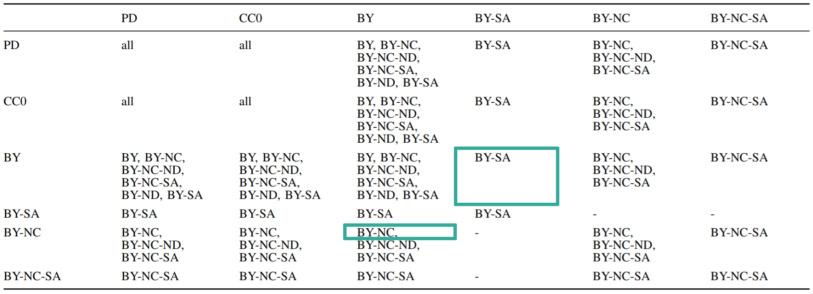

## D5.3 Lizenzintegrationskomponente

- Kombinierung von Datensätzen:  
  Wahl aus erlaubten Lizenzen
- Deliverable (Code): [licences](https://github.com/projekt-opal/licenses)

## D5.3 Lizenzen: Vokabulare

## D5.3 Lizenzen: Attribute

## D5.3 Lizenzen: Kombination

## D5.3 Lizenzen: Evaluierung

"Choose two works you wish to **combine or remix**. [...] Use at least the **most restrictive licensing** of the two (use the license **most to right or down state**) for the new work."
[CC wiki](https://wiki.creativecommons.org/index.php?title=Wiki/cc_license_compatibility&oldid=70058)

## D5.3 Lizenzen: Evaluierung

Auflistung aller kompatiblen Lizenzen zur Re-Lizensierung von kombinierten Datensätzen. ✓

