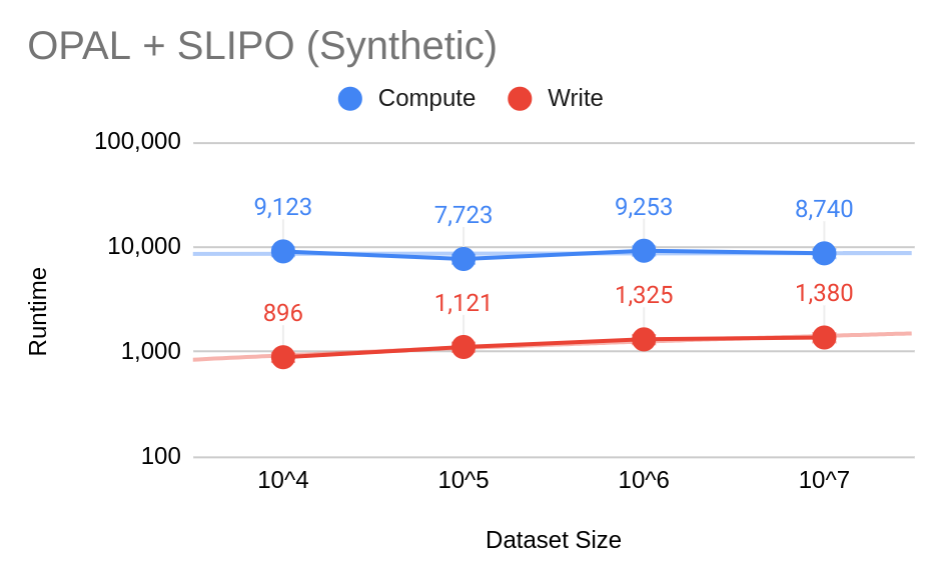
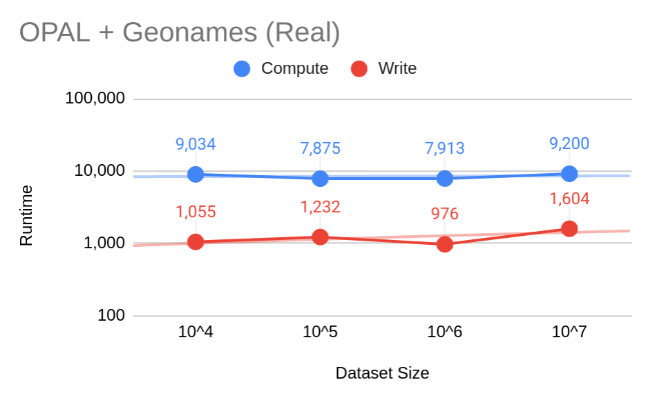
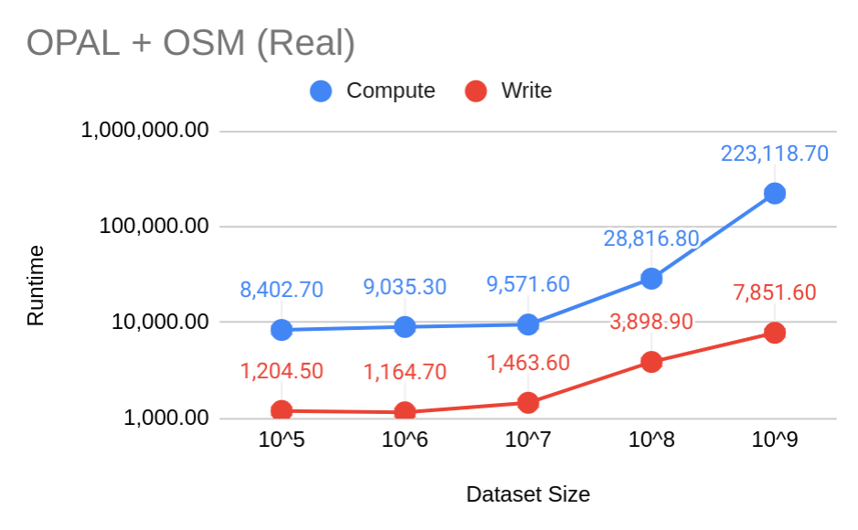

## D5.4 Erweiterte Lernalgorithmen für Linkspezifikationen auf Metadaten

- Daten:
    - OPAL LauNuts: 84.000 Koordinaten-Punkte
    - [LinkedGeoData.org](http://linkedgeodata.org/) ([OpenStreetMap](https://www.openstreetmap.org/) als RDF)
- ORCHID - Reduction-Ratio-Optimal Computation of Geo-Spatial Distances for Link Discovery
[PDF](https://link.springer.com/content/pdf/10.1007%2F978-3-642-41335-3_25.pdf)
[Springer](https://doi.org/10.1007/978-3-642-41335-3_25)

## D5.4: SLIPO

## D5.4: Geonames

## D5.4: OSM

Deliverable (Code): [LIMES Spark](https://github.com/dice-group/LIMES/tree/feature/hr3-spark) ✓

