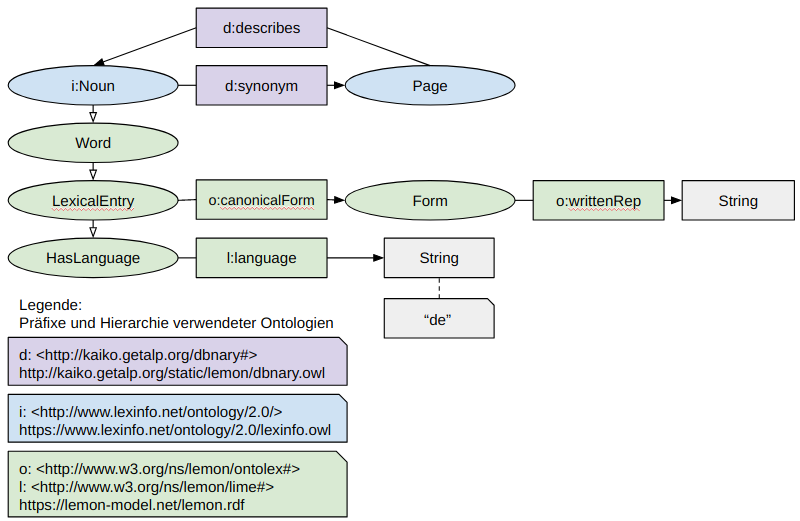

## D7.1 Suchkomponente: Elasticsearch

- Ansatz hier:  
  **Generierung von Synonym-Listen zur Auffindbarkeit**
- Ergebnis:
    - **6.668 deutschsprachige Nomen**,  
      für die Synonyme bekannt sind
    - **21.634 Synonyme** zu den entsprechenden Nomen
    - Auswahl von Nomen aus Titeln und Beschreibungestexten aus mCLOUD und GovData  
      → **1.497 Nomen und entsprechende Synonyme**

## D7.1 Suchkomponente: Elasticsearch

Deliverable als [PDF-Datei](https://hobbitdata.informatik.uni-leipzig.de/OPAL/Deliverables/OPAL_D7.1_Suchkomponente.pdf) ✓

