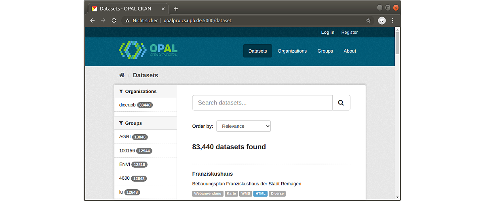

## D8.2 Erster Portalprototyp

- Deliverable als [PDF-Datei](https://hobbitdata.informatik.uni-leipzig.de/OPAL/Deliverables/OPAL_D8.2_First_portal_prototype.pdf)
- Konfiguration (Code):
  [opal-ckan-docker](https://github.com/projekt-opal/opal-ckan-docker)
  und  
  [opal-docker-compose](https://github.com/projekt-opal/opal-docker-compose) ✓

