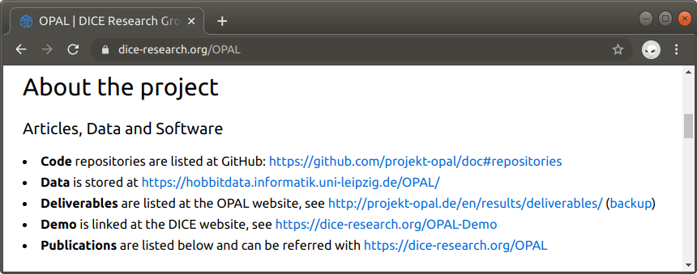
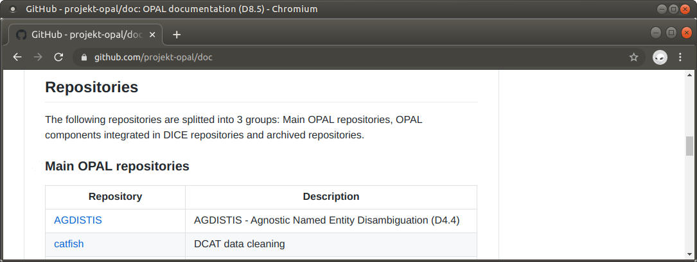

## D8.5 Anwenderdokumenation zum OPAL-Portal

- Anwender: Nutzer der Projektergebnisse
- Kurzbeschreibung Hauptkomponenten auf 40 Seiten:  
Deliverable als [PDF-Datei](https://hobbitdata.informatik.uni-leipzig.de/OPAL/Deliverables/OPAL_D8.5_Documentation.pdf)
- Übersicht auf Projektwebseite (folgt gleich)
- Code Dokumentation (folgt gleich)

## D8.5 Dokumentation: Projektwebseite

* Links zu Ergebnissen unterschiedlicher Typen
* Querverweise: Jeweils gleiche Liste von Links
* Mittel- und langfristige Auffindbarkeit
* [dice-research.org/OPAL](https://dice-research.org/OPAL)

## D8.5 Dokumentation: Code

- Rund 50 Repositorien
- Aufteilung Haupt- und Nebenprodukte
- Kurzbeschreibungen
- README Dateien und im Code
- [github.com/projekt-opal/doc](https://github.com/projekt-opal/doc)

