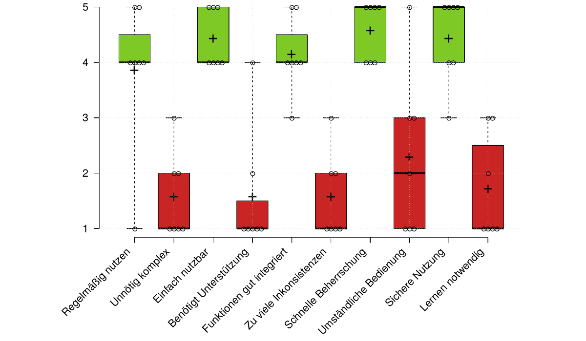

## D8.6 Evaluierungsergebnisse

- **System Usability Scale** (SUS)
- Bewertung der **Gebrauchstauglichkeit von Systemen**
- Einfacher und technologieunabhängiger Fragebogen
- 10 Fragen nach der Likert-Skala
    - Stimme überhaupt nicht zu (1)
    - Stimme voll und ganz zu (5)
- Kommentare und Feedback

## D8.6 Evaluierungsergebnisse

Deliverable als [PDF-Datei](https://drive.google.com/file/d/1cFzq97qGDHUWg7rlV-Io9RnNNS8y1vSQ/view?usp=sharing) ✓

