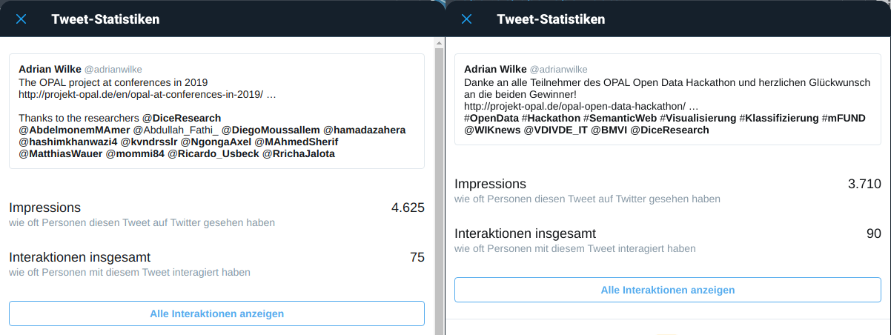

## D9.1 Kommunikations- und Disseminationsplan

- Deliverable als [PDF-Datei](https://hobbitdata.informatik.uni-leipzig.de/OPAL/Deliverables/OPAL_D9.1_Communication_and_dissemination.pdf)
- Projekt-Webseite: [https://dice-research.org/OPAL](https://dice-research.org/OPAL)
    - Portal Demo
    - Abschlussbericht und Deliverables (PDF)
    - Code (Github, Open Source)
    - Daten (Web, FTP)
    - Wissenschaftliche Publikationen
- mFUND Projektsteckbrief
- Anschlussprojekte
- Daten in mCLOUD
- Dissemination: außerdem Twitter
- Pub: Lizenzen, Bot, OPAL

## D9.1 Dissemination: Social Media

Twitter: [OPAL Tweets (Auszug)](https://twitter.com/search?q=opal%20(from%3ADiceResearch%20OR%20from%3Aadrianwilke%20OR%20from%3ANgongaAxel))

## D9.1 Dissemination: Blog und Publikationen

- **Blog**, z.B.: [OPAL Open Data Hackathon](http://projekt-opal.de/opal-open-data-hackathon/)
    - Zweisprachig
    - Studierende
- **Konferenzen und Publikationen**:
    - [OPAL Konferenzbeiträge 2019](http://projekt-opal.de/opal-konferenzbeitraege-2019/)
    - In 2019 in mind. 11 Beiträgen: "This work has been supported by the German Federal Ministry of Transport and Digital Infrastructure (BMVI) within the project OPAL under the grant no 19F2028A."

