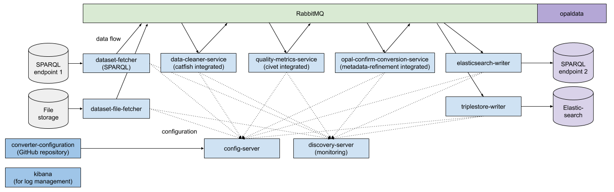

\newpage

### Arbeitspaket 4.2: Konvertierungskomponente

Im Projektverlauf wurde die ursprünglich geplante Architektur mehrfach erweitert und entsprechende Konvertierungsansätze getestet und angepasst. In der ursprünglich festgesetzten Architektur wurde ein Triplestore in der Datenhaltungsschicht zur Weitergabe von Datenversionen verwendet. Da sich dies als Flaschenhals herausstellte, erfolgte eine Erweiterung um Elasticsearch. Später wurde die auf Microservices aufbauende Converter Software auf den finalen OPAL Batch Ansatz umgestellt.

**Konvertierungskomponente Converter**

Die Converter-Komponente baut auf Publish-Subscribe Microservices über Spring Cloud auf. In Warteschlangen zur Verarbeitung werden Datensätze von mehreren, auf jeweilige Anwändungsfälle spezialisierte, Diensten verarbeitet. Änderungen in diesem funktionierende Verfahren stellte sich als aufwändig heraus, so dass später ein Umstieg auf das im Folgenden aufgeführte Batch-Verfahren erfolgte. Die nachfolgende Abbildung zeigt schematisch den Ablauf der ursprünglichen Verarbeitungskette der Converter-Komponente:

**Konvertierungskomponente Batch**

Die finale Konvertierungskomponente Batch integriert das Lesen von gecrawlten Ursprungsgraphdateien, die Ausführung einzelner Komponenten und das Schreiben nach Elasticsearch sowie ins Dateisystem. Die Konfiguration geschieht über eine Textdatei im Java-Properties Format, in der Einstellungen zu den einzelnen Berechnungsschritten festgelegt werden können. Nach dem Lesen der RDF-Graphen erfolgt eine Unterteilung in Datensatz-Graphen für jeweils ein DCAT Dataset und anschließend eine sequentielle Behandlung einzelner Datensatz-Graphen. OPAL Batch führt die folgenden Einzelkomponenten aus:

- Catfish: In der Datenbereinigung werden, je nach Konfiguration, inhaltsleere Strukturen entfernt, Tripel nicht-spezifizierter Sprachen entfernt, Datenformate bereinigt und Katalog-Identifizierer gesetzt.
- Metadata-Refinement: Es erfolgt eine Spracherkennung und eine Anreicherung mit Geodaten (siehe AP 3.3: Unstrukturierte Metadatenextraktion).
- Civet: Die Metadatenqualität der Datensätze wird geprüft und bewertet (siehe AP 3.1: Qualitätsanalyse).

Die folgende Abbildung zeigt den Datenfluss der Konvertierungskomponente:

**Weiterführende Inhalte**

* D4.2 Konvertierungskomponente (Afshin Amini, Zafar Habeed Syed, Matthias Wauer): [https://github.com/projekt-opal/doc/blob/master/deliverables/OPAL_D4.2_Conversion_component.pdf](https://github.com/projekt-opal/doc/blob/master/deliverables/OPAL_D4.2_Conversion_component.pdf)
* Software Batch: [https://github.com/projekt-opal/batch](https://github.com/projekt-opal/batch)
* Software Catfish: [https://github.com/projekt-opal/catfish](https://github.com/projekt-opal/catfish)
- Software Converter: [https://github.com/projekt-opal/converter](https://github.com/projekt-opal/converter)  
- Konfiguration Converter: [https://github.com/projekt-opal/converter-configuration](https://github.com/projekt-opal/converter-configuration)
