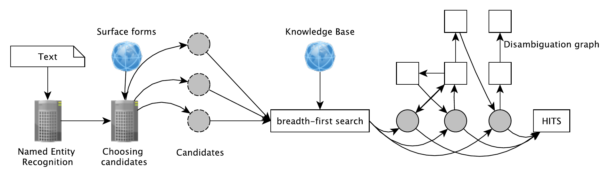

\newpage

### Arbeitspaket 4.4: Indizierungskomponente

Als Indizierungskomponente wurde die Software AGDISTIS in Kooperation mit dem LIMBO-Projekt erweitert. AGDISTIS wurde um Mehrssprachigkeit (MAG) sowie eine Elasticsearch-Anbindung erweitert und zur Disambiguierung/Linking von Entitäten eingesetzt. Es handelt sich um ein Graph-basiertes Verfahren, in dem der HITS Algorithmus eingesetzt wird. Die Integration in OPAL fand über die Einbindung der geografischen Datenbank LauNuts (siehe AP 3.3: Unstrukturierte Metadatenextraktion), der Eigennamenerkennung (siehe ebenfalls AP 3.3) und der Question-Answering Lösung (siehe AP 7.3: Social Bot) statt.

Die neuen wissenschaftlichen Ansätze sowie das OPAL Projekt wurden u.a. auf den Konferenzen European Semantic Web Conference (ESWC 2018) und Knowledge Capture Conference (K-CAP 2017) vorgestellt.

**Weiterführende Inhalte**

* Software Indizierungskomponente AGDISTIS: [https://github.com/projekt-opal/AGDISTIS](https://github.com/projekt-opal/AGDISTIS)
* Entity Linking in 40 Languages using MAG (Artikel von Diego Moussallem, Ricardo Usbeck, Michael Röder, Axel-Cyrille Ngonga Ngomo): [https://arxiv.org/abs/1805.11467](https://arxiv.org/abs/1805.11467)
* MAG: A Multilingual, Knowledge-base Agnostic and Deterministic Entity Linking Approach (Artikel von Diego Moussallem, Ricardo Usbeck, Michael Röder, Axel-Cyrille Ngonga Ngomo): [https://svn.aksw.org/papers/2017/KCAP_MAG/public.pdf](https://svn.aksw.org/papers/2017/KCAP_MAG/public.pdf)
