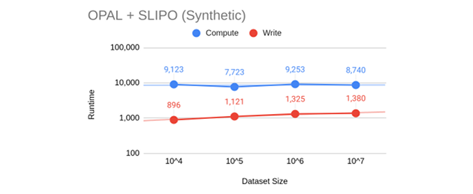
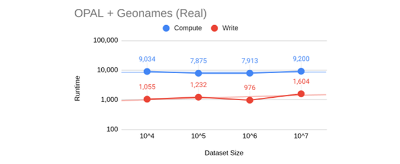
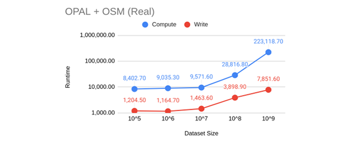

\newpage

### Arbeitspaket 5.3: Erweiterte Lernalgorithmen über Daten

Die Umsetzung von erweiterte Lernalgorithmen fand in ORCHID - Reduction-Ratio-Optimal Computation of Geo-Spatial Distances for Link Discovery statt. Hierzu wurden Experimente zum Linking von Geodaten durgeführt. Eingesetzt wurden primär die Datenbank OPAL LauNuts mit 84.000 Koordinaten-Punkten und LinkedGeoData, ein OpenStreetMap Derivat im RDF-Format. Die Distanzen der Geoobjekte konnten in performanter Weise errechnet werden. Im Folgenden sind die Laufzeiten von synthetischen und realen Daten aufgeführt:

**Weiterführende Inhalte**

* Software LIMES Spark: [https://github.com/dice-group/LIMES/tree/feature/hr3-spark](https://github.com/dice-group/LIMES/tree/feature/hr3-spark)
* ORCHID - Reduction-Ratio-Optimal Computation of Geo-Spatial Distances for Link Discovery (Artikel von Axel-Cyrille Ngonga Ngomo): [https://doi.org/10.1007/978-3-642-41335-3_25](https://doi.org/10.1007/978-3-642-41335-3_25)
* Datensatz LinkedGeoData: [http://linkedgeodata.org/](http://linkedgeodata.org/)
