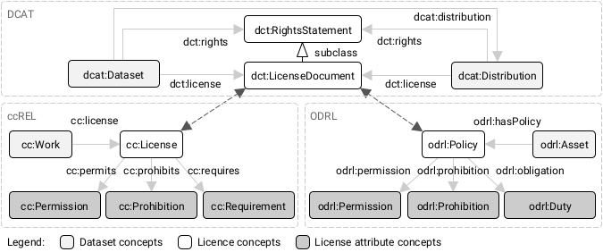
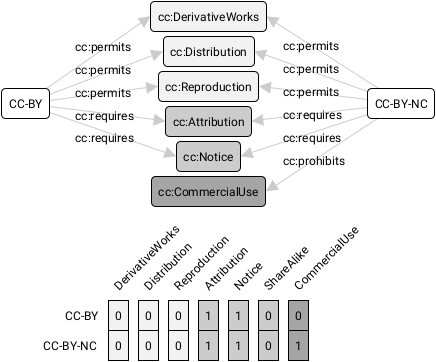

### Arbeitspaket 5.3: Erweiterte Lernalgorithmen über Daten

Die Integration von unterschiedlichen Datenquellen birgt die Gefahr, dass Daten mit inkompatiblen Lizenzen kombiniert werden. In OPAL werden für integrierte Datensätze die daraus resultierenden Lizenzbedingungen automatisch abgeleitet und annotiert. Hierfür ist die Nutzung und der
Ausbau eines W3C-Vorschlags59 zur automatischen Ableitung von
Lizenzen vorgesehen. Der Prototyp der Komponente soll eine Art
Assistenzfunktion bereitstellen, die den Nutzer bei der Auswahl mehrerer
Datensätze über die Lizenzbedingungen und mögliche Konflikte
informiert. Mehrfach lizenzierte Datenquellen und solche, deren
Lizenzinformation nur aus unstrukturierten begleitenden Daten extrahiert
werden können, sollen ebenfalls unterstützt werden.

- Kombinierung von Datensätzen:  
  Wahl aus erlaubten Lizenzen
- Deliverable (Code): [licences](https://github.com/projekt-opal/licenses)

#### D5.3 Lizenzen: Vokabulare

#### D5.3 Lizenzen: Attribute

#### D5.3 Lizenzen: Kombination

#### D5.3 Lizenzen: Evaluierung

"Choose two works you wish to **combine or remix**. [...]  
Use at least the **most restrictive licensing** of the two  
(use the license **most to right or down state**)  
for the new work."
[CC wiki](https://wiki.creativecommons.org/index.php?title=Wiki/cc_license_compatibility&oldid=70058)

#### D5.3 Lizenzen: Evaluierung

- Auflistung aller kompatiblen Lizenzen zur Re-Lizensierung von kombinierten Datensätzen.
-  Als **Artikel** in IEEE International Conference on Semantic Computing (**ICSC 2021**) Resource Track 

