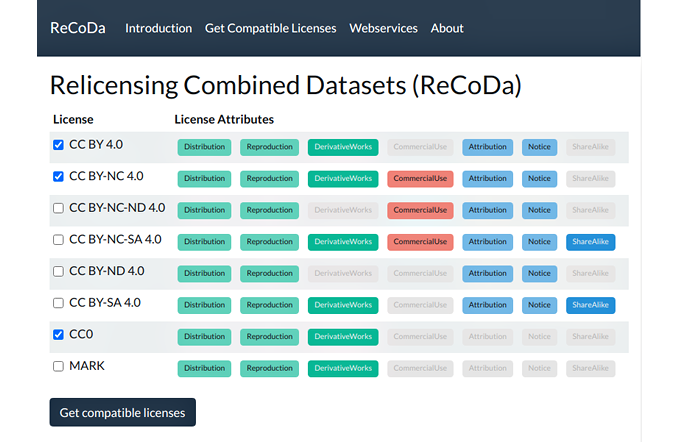

\newpage

### Arbeitspaket 5.4: Lizenzintegration

Um die Gefahr zu vermeiden, dass Daten mit inkompatiblen Lizenzen von Nutzern kombiniert werden, wurde in OPAL ein Ansatz entwickelt, mit dem Lizenzen über ihre Attribute auf Kompatibilität geprüft werden. Der Prototyp stellt eine Assistenzfunktion bereit, die Nutzern Informationen darüber liefert, ob mehrere Datensatz-Lizenzen kompatibel sind und welche Lizenzen für eine Relizensierung der kombinierten Datensätze verwendet werden können. Unter dem Namen ReCoDa wurde ein Prototyp erstellt und ein Artikel auf der IEEE International Conference on Semantic Computing (ICSC 2021) gemeinsam mit dem OPAL-Projekt vorgestellt. Die folgende Abbildung zeigt die Nutzeroberfläche des Prototypen:

#### D5.3 Lizenzen: Evaluierung

- Relicensing Combined Datasets (Artikel von Adrian Wilke, Arwa Bannoura, Axel-Cyrille Ngonga Ngomo): [https://papers.dice-research.org/2021/ICSC2021_ReCoDa/Relicensing-Combined-Datasets-ReCoDa-public.pdf](https://papers.dice-research.org/2021/ICSC2021_ReCoDa/Relicensing-Combined-Datasets-ReCoDa-public.pdf)
- Software Demo: [https://dice-research.org/ReCoDa](https://dice-research.org/ReCoDa)
- Software Code: [https://github.com/dice-group/ReCoDa](https://github.com/dice-group/ReCoDa)

