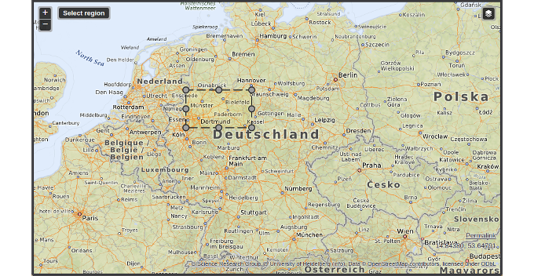

\newpage

### Arbeitspaket 6.2: Slicing von Geodaten

Die Indexierung und Speicherung von angereicherten Geodaten geschieht aufbauend auf der Suchmaschine Elasticsearch. Zum Zugriff dieser Daten wurden OPAL Webservices eingerichtet, die die Elasticsearch Geodaten API verwenden. Nach Angabe einer BoundingBox, bestehend aus zwei Koordinaten, werden die im ausgewählten Bereich verfügbaren Datensätze zurückgegeben.

Im Rahmen des OPAL Open Data Hackathon wurde eine bestehende Softwarekomponente erweitert und an die Anforderungen des OPAL Portals angepasst. In einer Web-Komponente basierend auf OpenLayers wird eine Karte angezeigt. Portalnutzer können eine BoundingBox auf der Karte aufziehen. Datensätze, deren Koordinaten sich innerhalb der Markierung befinden, werden entsprechend im OPAL Portal aufgelistet.

**Weiterführende Inhalte**

- Software Spatial Slicing: [https://github.com/projekt-opal/hackathon/tree/gh-pages/geo](https://github.com/projekt-opal/hackathon/tree/gh-pages/geo)
- OpenLayers: [https://openlayers.org/](https://openlayers.org/)
