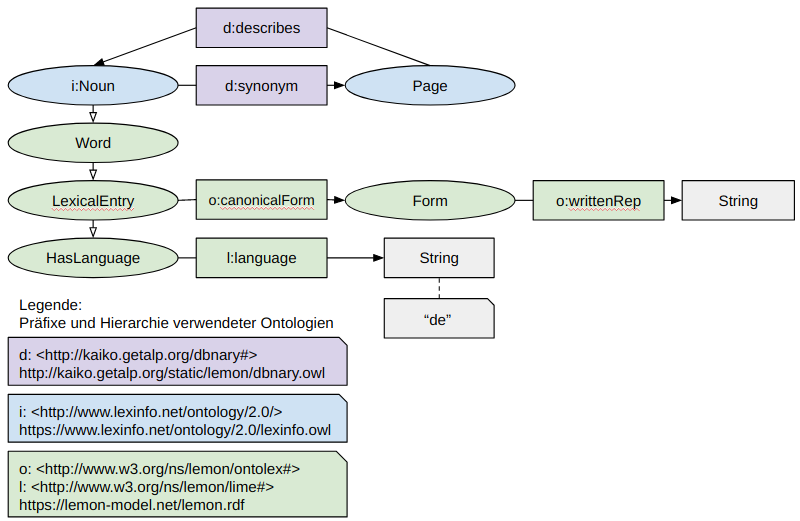

\newpage

### Arbeitspaket 7.1: Suche

Auch mit der Indexierung von Volltexten bleibt das Problem der Verwendung von Suchbegriffen bestehen, die nicht in den ursprünglichen Metadaten enthalten sind. Obwohl ein Anwender semantisch korrekte Begriffe verwendet, werden potenziell verfügbaren Datensätze nicht gefunden.
Beispielsweise könnte ein Volltext das Wort “Stadtbahn” enthalten. Die Verwendung von
Suchbegriffen wie “S-Bahn” oder “Straßenbahn” würde den entsprechenden Datensatz ggf. nicht
finden. Um die Auffindbarkeit zu verbessern können Synonyme (unterschiedliche Begriffe
ähnlicher Bedeutung) aufgelöst werden. Hierdurch werden zusätzliche semantisch verwandte
Begriffe in die Suche einbezogen.

Zur Verbesserung der Auffindbarkeit von Datensätzen werden Begriffe einbezogen, die nicht direkter Bestandteil von Volltexten sind. Dies geschieht über eine Generierung von Synonym-Listen, die anschließend in die Suche eingebunden werden können. Die Extraktion der Synonyme geschieht über eine SPARQL Anfrage und folgender Verfeinerung:

1. Filterung aller Nomen in deutscher Sprache,
2. Einschränkung auf die deutschsprachigen Nomen, für die Synonyme spezifiziert sind,
3. Extraktion der kanonischen Form der einzelnen deutschsprachigen Nomen und
4. Extraktion der kanonischen Formen der jeweiligen Synonyme.

\newpage

Als Ergebnis wurden 6.668 deutschsprachige Nomen extrahiert, für die Synonyme bekannt sind. Zu den entsprechenden Nomen wurden insgesamt 21.634 Synonyme zu den entsprechenden Nomen gefunden. Abschließend wurden die extrahierten Nomen mit den Titeln und Beschreibungstexten der
Metadaten aus mCLOUD und GovData abgeglichen und damit die Anzahl relevanter Suchdaten eingeschränkt. Final stehen 1.497 Nomen aus mCLOUD und GovData sowie die entsprechenden Synonyme bereit.

**Benchmarking der Suchkomponente**

Der Benchmarking der Suchkomponente erfolgte über einen empirischen Vergleich der Laufzeiten der Datenhaltungslösungen Elasticsearch und dem RDF Triplestore Apache Fuseki. Hierzu wurden annähernd 60.000 Datensätze in den Varianten gespeichert. Anschließend fand eine Laufzeitanalyse über fünf Abfragen statt, die jeweils 100 mal ausgeführt wurden. Danach wurden das arithmetische Mittel sowie die Standardabweichungen errechnet. Als Ergebnis lässt sich festhalten, dass einfache Abfragen rund 4 mal performanter mit Elasticsearch durchgeführt wurden. Erweiterte Abfragen (mit SPARQL Filtern) erfolgten 5 bis 20 mal performanter mit Elasticsearch.

**Weiterführende Inhalte**

* D7.1 Suchkomponente (Adrian Wilke, Caglar Demir): [https://github.com/projekt-opal/doc/blob/master/deliverables/OPAL_D7.1_Suchkomponente.pdf](https://github.com/projekt-opal/doc/blob/master/deliverables/OPAL_D7.1_Suchkomponente.pdf)
* D7.2  Benchmarking der Suchkomponente (Caglar Demir, Adrian Wilke): [https://github.com/projekt-opal/doc/blob/master/deliverables/OPAL_D7.2_Search-component-benchmark.pdf](https://github.com/projekt-opal/doc/blob/master/deliverables/OPAL_D7.2_Search-component-benchmark.pdf)
* Software Search-Component-Benchmark: [https://github.com/projekt-opal/Search-Component-Benchmark](https://github.com/projekt-opal/Search-Component-Benchmark)
