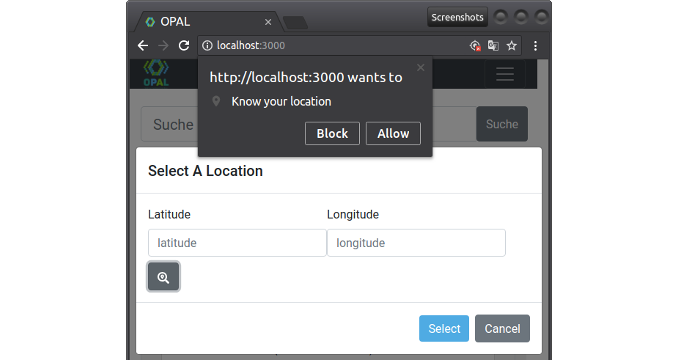

\newpage

### Arbeitspaket 7.2: Mobile App

Für den Demonstrator der mobilen Applikation wurde zwischen nativen Lösungen für Smartphones und einer Webkomponente abgewogen. Da der Nutzen nativer Lösungen im Verhältnis zum Entwicklungsaufwand als gering eingeschätzt wurde, viel die Entscheidung zugunsten einer Webapplikation aus. Die Implementierung geschah als Integration in das OPAL Webportal. Das Portal wurde dementsprechend mit Responsivem Webdesign gestaltet, so dass eine optimierte Ansicht für mobile Endgeräte verfügbar ist. Nutzer können bei der Sortierung von Datensätzen einen Standort eingeben oder diesen über die W3C Geolocation API Spezifikation vom Gerät abfragen lassen. Anschließend werden Datensätze nach aufsteigendem Abstand zum Standort aufgelistet, so dass eine Identifikation von Daten am anktuellen Standort erfolgt und relevante Datensätze im Umfeld angezeigt werden.

**Weiterführende Inhalte**

* Software OPAL Web UI: [https://github.com/projekt-opal/web-ui](https://github.com/projekt-opal/web-ui)
* W3C Geolocation API Spezifikation: [https://w3c.github.io/geolocation-api/](https://w3c.github.io/geolocation-api/)
