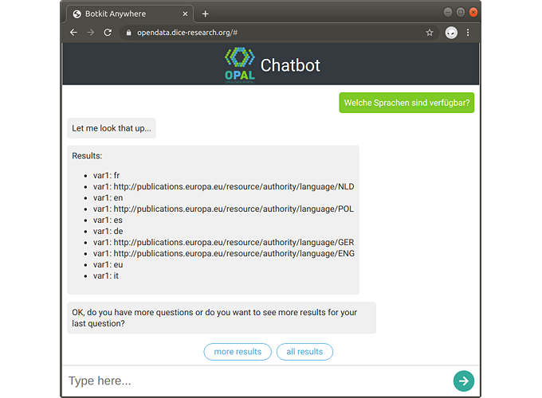

\newpage

### Arbeitspaket 7.3: Social Bot

Die Social Bot Komponente wurde innerhalb einer Bachelorarbeit verwirklicht. Dabei wurde, im Gegensatz zu generischen Entwicklungen, ein Question Answering System entwickelt, dass speziell auf die unterliegende DCAT-Datenstruktur abzielt. Es wurde ein Template-basierter Ansatz umgesetzt, mit dem natürlichsprachige Anfragen analysiert und Entitäten erkannt werden. Anschließend wird ein passendes Template selektiert, Dantenbank-Anfragen ausgeführt und die entsprechenden Ergebnisse zurückgegeben. Als Nutzerschnittstellen wurden eine Web-Ansicht sowie eine Twitter-Anbindungen realisiert. Die Arbeit wurde von Mitarbeitern aus den Projekten OPAL und LIMBO betreut.

**Weiterführende Inhalte**

* D7.3 Social Media Bot Demonstrator "A Question Answering (QA) System for the Data Catalog Vocabulary (DCAT)" (Marten Louis Schmidt, Daniel Vollmers, Adrian Wilke): [https://github.com/projekt-opal/dcat-qa/blob/thesis/thesis.pdf](https://github.com/projekt-opal/dcat-qa/blob/thesis/thesis.pdf)
* Software DCAT QA: [https://github.com/projekt-opal/dcat-qa](https://github.com/projekt-opal/dcat-qa)
