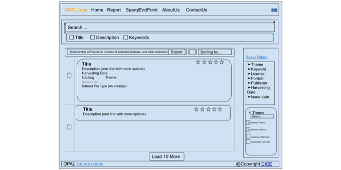

\newpage

### Arbeitspaket 8.2: Integration des Portalsystems 

Der erste Portalprototyp (D8.2) basiert auf der Datenkatalog-Software CKAN. Während des Projektverlaufs stellte sich heraus, dass die Geschwindigkeit des Datenimports sowie die unterliegende relationale Datenbank nicht den Projektanforderungen entsprachen. Zur Datenanalyse erfolgte eine Umstellung auf RDF. Der folgende Screenshot zeigt den ersten Protalprototyp: 

Für den erweiterten Portaldemonstrator (D8.3) wurde eine Architektur basierend auf den oben beschriebenen Technologien (Arbeitspaket 8.1) entwickelt. Die folgende Abbildung zeigt einen Entwurf der geplanten Frontend-Elemente und Filtermöglichkeiten. Diese wurden in Arbeitspaket 8.3 umgesetzt.

**Weiterführende Inhalte**

* D8.2 Erster Portalprototyp (Zafar Habeeb Syed, Afshin Amini, Adrian Wilke, Matthias Wauer): [https://github.com/projekt-opal/doc/blob/master/deliverables/OPAL_D8.2_First_portal_prototype.pdf](https://github.com/projekt-opal/doc/blob/master/deliverables/OPAL_D8.2_First_portal_prototype.pdf)
* D8.3 Erweiterter Portaldemonstrator (Afshin Amini, Adrian Wilke): [https://github.com/projekt-opal/doc/blob/master/deliverables/OPAL_D8.3_Enhanced_portal_demonstrator.pdf](https://github.com/projekt-opal/doc/blob/master/deliverables/OPAL_D8.3_Enhanced_portal_demonstrator.pdf)
* Software CKAN: [https://github.com/projekt-opal/docker-ckan](https://github.com/projekt-opal/docker-ckan)
