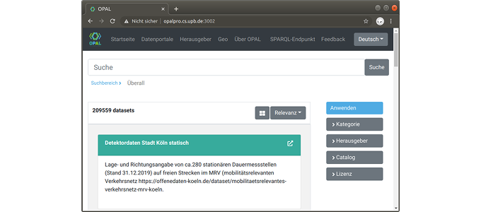
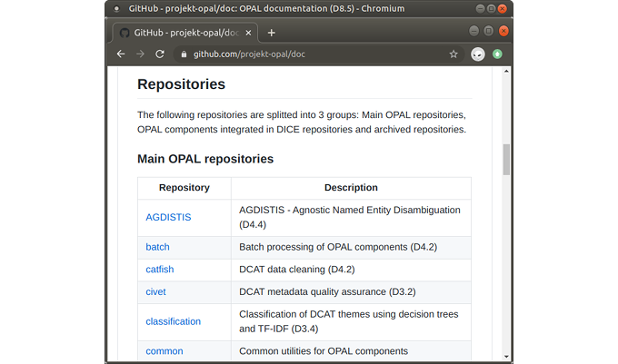

\newpage

### Arbeitspaket 8.3: Webportal

**OPAL Portal**

Das finale OPAL-Portal wurde mit den Technologien aus Arbeitspaket 8.1 und dem Enwurf aus Arbeitspaket 8.2 umgesetzt. Das zentrale Element ist die Suchfunktion, mit der Titel, Beschreibungstexte und Stichwörter durchsucht werden können. Metadatensätze können nach Kategorien, Herausgebern, Katalogen und Lizenzen gefiltert werden. Zusätzlich zur Anzeige der größten Datenquellen und -herausgebern sind die mobile App sowie das räumliche Slicing implementiert.

**Anwenderdokumentation**

Hinsichtlich der Weiterverwertung der Projektergebnisse ist eine Dokumentation für entsprechende Anwender notwendig. Zur mittel- und langfristigen Auffindbarkeit wurden die entsprechenden Produkte auf verschiedenen Online-Plattformen zugänglich gemacht. Die wissenschaftlichen Ergebnisse wurden als Dokumente im PDF Format veröffentlicht und sind sowohl auf der DICE Projektwebseite als auch über die URLs in diesem Dokument verfügbar.

Über die Projektwebseite sind außerdem die erstellten Deliverables aus den Arbeitspaketen, Quelldaten, verfeinerte Daten sowie das OPAL Webportal offen abrufbar.

Zur Wiederverwendung und Weiterentwicklung der Softwarekomponenten steht mit D8.5 eine technische Anwenderdokumenation bereit. 

Im Projektverlauf wurden rund 50 Code-Repositorien erstellt. Zur Dokumentation fand eine Aufteilung in Haupt- und Nebenprodukte statt, die mit Kurzbeschreibungen auf der Repositorien Dokumentation aufgeführt sind.

**Weiterführende Inhalte**

* Demonstrator OPAL Portal: [https://dice-research.org/OPAL-Demo](https://dice-research.org/OPAL-Demo)
* Software OPAL Portal: [https://github.com/projekt-opal/demo](https://github.com/projekt-opal/demo)
* D8.5: Anwenderdokumenation zum OPAL-Portal (Adrian Wilke): [https://github.com/projekt-opal/doc/blob/master/deliverables/OPAL_D8.5_Documentation.pdf](https://github.com/projekt-opal/doc/blob/master/deliverables/OPAL_D8.5_Documentation.pdf)
* Dokumentation Repositorien: [https://github.com/projekt-opal/doc#repositories](https://github.com/projekt-opal/doc#repositories)
* DICE Projektwebseite: [https://dice-research.org/OPAL](https://dice-research.org/OPAL)
