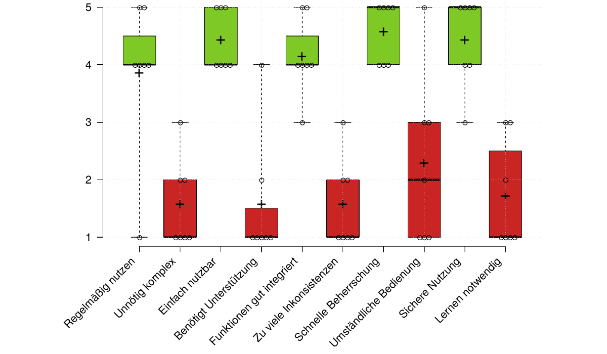

\newpage

### Arbeitspaket 8.4: Evaluation von Portal und Anwendungen

Zur Evaluation des Webportals wurde eine Umfrage basierend auf System Usability Scale (SUS) durchgeführt. SUS ist ein einfacher und technologieunabhängiger Fragebogen, mit dem eine Bewertung der Gebrauchstauglichkeit von Systemen vorgenommen wird. Er besteht aus 10 Fragen nach der Likert-Skala, die von *Stimme überhaupt nicht zu (1)* bis *Stimme voll und ganz zu (5)* reicht. Die nachfolgende Abblildung zeigt das Ergebnis der Umfrage, welches eine positive Resonanz von Anwendern darstellt:

Eine technische Evaluierung fand in den Deliverables D2.3/D2.6 (Crawler Benchmark), D4.3 (Indexstrukturen) und D7.2: (Benchmark Suchkomponente) statt.

**Weiterführende Inhalte**

* D8.6 Evaluierungsergebnisse (Arwa Bannoura, Adrian Wilke): [https://github.com/projekt-opal/doc/blob/master/deliverables/OPAL_D8.6_Evaluation.pdf](https://github.com/projekt-opal/doc/blob/master/deliverables/OPAL_D8.6_Evaluation.pdf)
