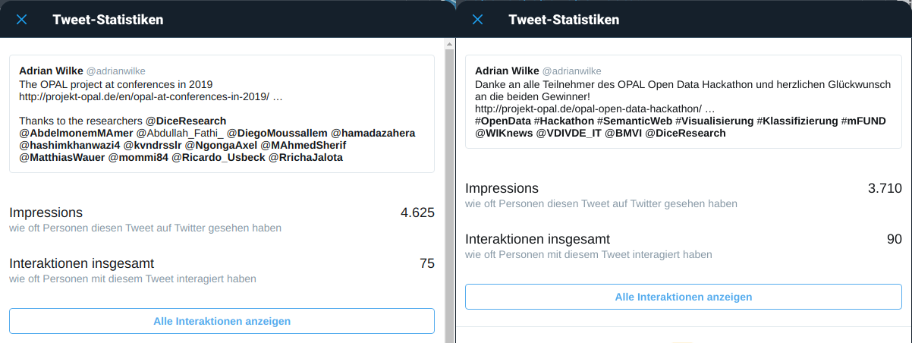

\newpage

### Arbeitspaket 9: Projektmanagement 

Die Projektberichte für die entsprechenden Zeitpunkte wurden eingereicht.

**Kommunikation und Dissemination**

Ein Austausch und eine Vernetzung mit Unternehmen und Wissenschaftlern aus dem Bereich Mobilitätsdaten fand in erster Linie über Teilnahmen and mFUND Workshops statt. Zudem wurde das OPAL Projekt bereits auf der mFUND-Konferenz 2018 vorgestellt.

Die Dissemination in der Wissenschaft fand über rund 30 Publikationen statt. Auf den jeweiligen Konferenzen wurde das OPAL Projekt in Bezug auf die jeweiligen Konferenzbeiträge vorgestellt. In den zugehörigen Publikationen ist das Projekt mit Förderkennzeichen jeweils aufgeführt.

Die Zielgruppe der Studierenden wurde primär im Rahmen des OPAL Open Data Hackathon am 6. April 2020 einbezogen. Der ursprünglich geplante Hackathon musste aufgrund der Corona-Pandemie umgestellt werden und fand online statt.

Die allgemeinen Kommunikation und Dissemination fand über die Veröffentlichung von Blogbeiträgen statt. Es wurden die Themen mFUND-Konferenz und -Workshops, Datenanalysen, wissenschaftliche Konferenzbeiträge, Hackathon und Abschlusspräsentation vorgestellt. Zudem konnte die Reichweite der DICE Fachgruppe auf Twitter zur Dissemination von Projektergebnissen beitragen.

**Weiterführende Inhalte**

* D9.1: Kommunikations- und Disseminationsplan (Matthias Wauer): [https://github.com/projekt-opal/doc/blob/master/deliverables/OPAL_D9.1_Communication_and_dissemination.pdf](https://github.com/projekt-opal/doc/blob/master/deliverables/OPAL_D9.1_Communication_and_dissemination.pdf)
* OPAL Open Data Hackathon: [https://projekt-opal.github.io/hackathon/](https://projekt-opal.github.io/hackathon/)
* Neuigkeiten Blog: [http://projekt-opal.de/category/allgemein/](http://projekt-opal.de/category/allgemein/)
* Twitter Suche OPAL: [https://twitter.com/search?q=OPAL%20%20(%40DiceResearch)](https://twitter.com/search?q=OPAL%20%20(%40DiceResearch))
